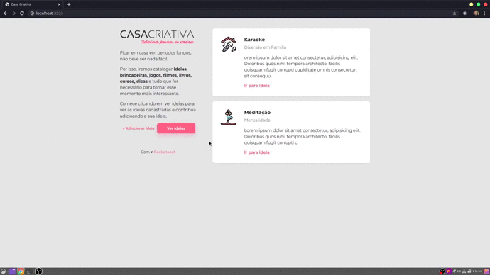

<h1 align="center">
    
</h1>

<h4 align="center">
  🚀 Workshop Dev by Rocketseat
</h4>

  
  
  

## 📱 Interfaces
O front-end da aplicação conta com três interfaces sendo uma delas para cadastro de novas idéis e outras duas apenas para a apresentação das ideias já cadastradas.

    

## 📰 Back-end

No back-end ou API, é onde de fato as funções de cadastro, busca, login, entre outras são executadas. É responsabilidade dele também realizar a integração com bando de dados insirindo e buscando informações. Por default, a API está utilizando a porta `3333`, mas que pode ser alterada no arquivo **server.js**.

## 🌱 Rotas
| Rota | Método | Função | Descrição |
| :--- | :--- | :--- | :---|
| `/` | `POST` | `IdeiaController.store` | `Cadastra um nova ideia no bando de dados do sistema` |
| `/` | `GET` | `IdeiaController.show` | `Busca as ultimas duas ideias que foram cadastradas no sistema.` |
| `/ideias` | `GET` | `IdeiaController.index` | `Busca no banco de dados todas as ideias já cadastradas` |

-------------------------

## 🔄 Executar
- Entrar na pasta `App`;
- Executar `yarn install` para instalar dependências do projeto;
- Executar `yarn start` para que o projeto seja executado;

## 📝 Licença
Este projeto está sobre a licença MIT. Veja o arquivo [LICENSE](../LICENSE.md) para mais detalhes.

---
<h4 align="center">
  Feito com ❤️ by Gustavo Souza
</h4>
